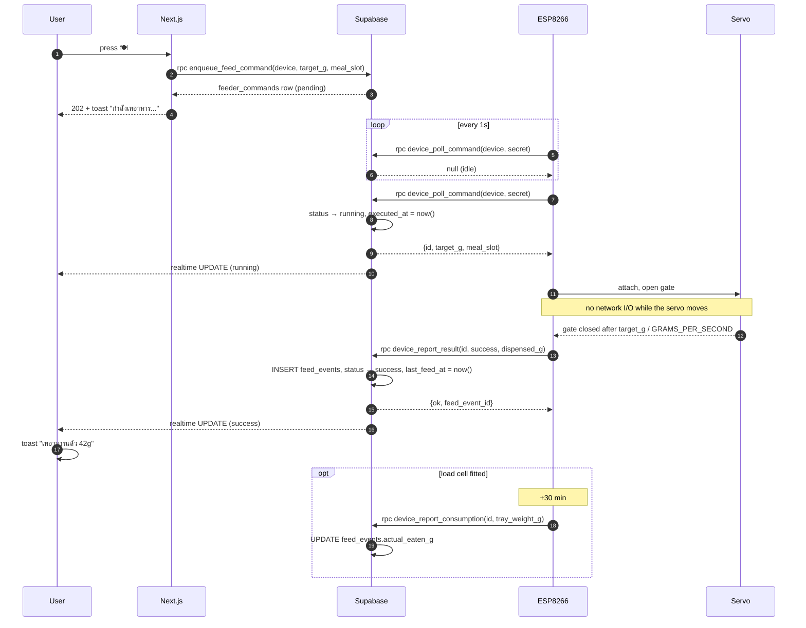

# Petpet hardware integration

How the NodeMCU ESP-12E (ESP8266) feeder talks to the web app, and how to
build, provision, flash and debug one.

---

## 1. Architecture

```
Browser ──POST /api/feed/manual──▶ Next.js ──rpc enqueue_feed_command──▶ Supabase
                                                                          │
                                              feeder_commands (pending)   │
                                                                          ▼
ESP8266 ──1 Hz rpc device_poll_command (anon key + device secret)────────▶│
   │                            ◀── {id, command, target_g, meal_slot}    │
   │                                status → running                      │
   ├─ servo dispense                                                      │
   └──rpc device_report_result───────────────────────────────────────────▶│
                                    status → success, INSERT feed_events  │
                                                                          │
Browser ◀────────── Realtime UPDATE on feeder_commands ────────────────────┘
                    toast "กำลังเทอาหาร..." → "เทอาหารแล้ว 42g"
```

The feeder talks **directly to Supabase**, never to the Next.js app. Two
consequences worth knowing:

- The feeder keeps working when the website is down or Vercel is cold.
- A 1 Hz poll is a database query, not a serverless invocation. Routing it
  through Vercel would mean ~86,400 function calls per device per day.

### What the device secret does and does not protect

The anon key in the firmware headers is **public** — the browser ships the
same key — so it authenticates nothing. The real credential is
`DEVICE_SECRET`, verified as a sha256 hash inside `SECURITY DEFINER`
functions against the `devices` table, which is deny-all to `anon`.

| Attack | Prevented? |
|---|---|
| Read another feeder's secret | Yes — `devices` is deny-all, no policies |
| Forge meal history | Yes — `anon` has no INSERT on `feed_events` |
| Steal/complete another feeder's command | Yes — `device_id` is in the update predicate |
| Report readings as another device | Yes — needs that device's secret |
| Replay a result report | Yes — idempotent against the `running` state |
| Queue two feeds at once | Yes — partial unique index on `(device_id)` |
| Feed in a loop to overfeed the animal | Bounded — 10 commands/device/hour |
| **Trigger a single feed on your feeder** | **No** |

That last row is deliberate and worth stating plainly: `enqueue_feed_command`
takes no secret, because the web app runs on the public anon key and a secret
there would just be published to every browser. Anyone who can guess a
`device_id` can queue a feed.

**Rate limiting bounds the damage but is not authentication.** Ten commands per
device per hour (`0007`) leaves room for three scheduled meals plus retries,
and turns "empty the hopper into the bowl" into "one unwanted meal". Exceeding
it raises SQLSTATE `54000`, which `/api/feed/manual` surfaces as HTTP 429 with
a Thai message rather than a generic 500.

Genuinely closing this needs user accounts. Supabase Auth was removed on
purpose in migration 0002 (no login, no sessions, no `@supabase/ssr`), so
"authenticated users only" is not a tweak to this design — it is a different
design, and `/api/feed/manual` is itself unauthenticated, so moving enqueue
behind the service-role key would only relocate the boundary. Left as a known
limitation rather than half-built.

---

## 2. Database

Migration: `supabase/migrations/0005_feeder_commands.sql`.

### `devices`

The secret store. RLS enabled with **zero policies**, which denies everything,
plus an explicit `revoke all`. Not in the realtime publication.

| Column | Type | Notes |
|---|---|---|
| `device_id` | `text` PK | e.g. `PETFEEDER-001` |
| `label` | `text` | free text, e.g. `kitchen` |
| `secret_hash` | `text` | sha256 hex of the provisioning token |
| `created_at` | `timestamptz` | |

The secret cannot live on `device_status`: that table is world-readable and
realtime-published, so it would be broadcast to every open dashboard.

sha256 rather than bcrypt because this is verified on **every 1 Hz poll**
(86,400 times per device per day) and the token is 256 bits of randomness — a
slow KDF costs real database CPU and buys nothing against a secret that was
never guessable.

### `feeder_commands`

| Column | Type | Notes |
|---|---|---|
| `id` | `uuid` PK | |
| `device_id` | `text` | only the matching device may execute |
| `command` | `text` | `feed` (CHECK-constrained; see §9) |
| `status` | `text` | `pending` → `running` → `success` \| `failed` |
| `meal_slot` | `text` | fixed at **enqueue** time, not execution |
| `source` | `text` | `app` \| `schedule` \| `retry` |
| `target_g` | `numeric` | what was commanded |
| `dispensed_g` | `numeric` | what the load cell measured — not the same thing |
| `tray_before_g`, `tray_after_g` | `numeric` | |
| `error` | `text` | machine-readable code, see below |
| `attempts` | `int` | incremented on each claim |
| `retry_of`, `feed_event_id` | `uuid` | not FKs — this schema has had none since 0002 |
| `created_at`, `updated_at`, `executed_at`, `finished_at` | `timestamptz` | |

Indexes:

| Index | Why |
|---|---|
| `(device_id, created_at) where status='pending'` | the 1 Hz poll; partial, so it stays tiny forever |
| `(status, created_at) where status in ('pending','running')` | the expiry sweep |
| `(device_id, created_at desc)` | history reads |
| `unique (device_id) where status in ('pending','running')` | **structurally prevents double-feeding** |

That last one is the safety property: a double-tapped button, two open tabs,
or a retry storm cannot produce two live commands for one feeder.

**`anon` can SELECT `feeder_commands`, and that is intentional.** Supabase
Realtime evaluates `postgres_changes` under the *subscriber's* role, so
without a SELECT grant the dashboard would never receive a status change and
the feed toast would hang forever. The row holds no secret, and every other
table in this schema has been world-readable since migration 0002. All writes
are denied.

### Error codes

Stored in English so firmware, SQL and logs share one vocabulary; translated
to Thai once, in `src/lib/feeder-commands.ts`.

| Code | Meaning |
|---|---|
| `timeout_pickup` | no device claimed it within 60s — feeder offline |
| `timeout_execute` | claimed, then went quiet for 120s |
| `jam` | food jammed in the chute |
| `empty_tank` | hopper empty |
| `no_scale` | load cell not responding |
| `aborted` | dispense cancelled |
| `device_error` | anything else the firmware reports |

### Timeouts

There is no `pg_cron`. `expire_stale_commands()` runs lazily at the top of
`device_poll_command()` and `device_health()`, so a command expires the moment
anything next looks at the system. When the feeder is offline nothing polls —
which is exactly why the dashboard calls `device_health()` when it gives up on
a feed.

Retry is possible (`retry_of`, `attempts`) but manual: press the button again.

---

## 3. API

All endpoints are `POST https://<project>.supabase.co/rest/v1/rpc/<function>`
with these headers:

```
apikey: <ANON_KEY>
Authorization: Bearer <ANON_KEY>
Content-Type: application/json
```

### `device_poll_command`

```jsonc
// →
{ "p_device_id": "PETFEEDER-001", "p_secret": "<token>" }

// ← 200, work available
{ "id": "3f9c…", "command": "feed", "target_g": 42, "meal_slot": "lunch" }

// ← 200, idle (a literal 4-byte body — the cheapest possible poll)
null

// ← 403 wrong secret / unregistered device
```

Side effects: refreshes `last_seen_at` (throttled to 10s, because
`device_status` is realtime-published and a 1 Hz broadcast to every dashboard
would be pure waste), runs the expiry sweep, and claims the oldest pending
command with `FOR UPDATE SKIP LOCKED` so two pollers can never take the same
one.

### `device_report_result`

```jsonc
// →
{ "p_device_id": "PETFEEDER-001", "p_secret": "<token>",
  "p_command_id": "3f9c…", "p_success": true,
  "p_dispensed_g": 41.6, "p_tray_weight_g": 41.6 }

// ← 200
{ "ok": true, "status": "success", "feed_event_id": "8b21…" }

// ← 200 on a replay — no second feed_event is created
{ "ok": true, "status": "success", "feed_event_id": "8b21…", "duplicate": true }
```

Failure form: `"p_success": false, "p_error": "jam"`.

**This is the only thing in the system that writes `feed_events`**, and it is
idempotent against the `running` state — which is precisely why the firmware
can safely retry a report after a dropped connection.

### `device_report_consumption`

```jsonc
// → 30 min after a successful feed
{ "p_device_id": "…", "p_secret": "…", "p_command_id": "3f9c…",
  "p_tray_weight_g": 12.0 }

// ← 200
{ "ok": true, "actual_eaten_g": 29.6 }
```

`actual_eaten_g = max(0, tray_after_g − settled_tray_g)`. Requires a load cell.

### `device_report_reading`

```jsonc
{ "p_device_id": "…", "p_secret": "…",
  "p_tray_weight_g": 41.6, "p_tank_weight_g": 900.0,
  "p_uv_status": false, "p_wifi_rssi": -58, "p_firmware_version": "1.0.0" }
```

Inserts into `feeder_readings` (which had no writer at all before this) and
upserts `device_status`.

### `enqueue_feed_command` / `device_health`

App-facing, no secret. `enqueue_feed_command` is idempotent — it returns any
existing pending/running command rather than queueing a second.
`device_health` returns liveness plus `server_time`, so online/offline is
judged against the server's clock rather than the viewer's.

---

## 4. Sequence



Offline feeder: the command stays `pending`, the dashboard's 15s deadline
fires, it calls `device_health()` which runs the expiry, and the row becomes
`failed` / `timeout_pickup`.

---

## 5. ESP8266 flow

```
                ┌──────────────────┐
   boot ───────▶│ ST_WIFI_CONNECT  │◀── WiFi lost (any state)
                └────────┬─────────┘    backoff 1s→30s, reboot after 5 min
                         ▼
                ┌──────────────────┐
                │   ST_NET_INIT    │  TLS setup, MFLN probe, keep-alive on
                └────────┬─────────┘
                         ▼
        ┌───────────────────────────────┐
        │           ST_IDLE             │  poll @1Hz · readings @60s
        │                               │  consumption @30min after a feed
        └───────┬───────────────────────┘
                │ command received
                ▼
        ST_DISPENSE_OPEN → ST_DISPENSE_WAIT → ST_DISPENSE_CLOSE
                │            (no network I/O)          │
                │                                      ▼
                │                              ST_WEIGH_AFTER
                │                                      │
                └──────────────────────────────────────▼
                                                  ST_REPORT
                                            (3 retries, then let the
                                             server time it out)
```

Every deadline is an absolute `millis()` stamp compared by subtraction, so the
49.7-day rollover is a non-event. No `delay()` is used for scheduling.

**The firmware needs no correct clock for business logic.** Every timestamp
(`created_at`, `executed_at`, `ts`, `last_seen_at`) is Postgres `now()`; the
device only measures durations. NTP is required *only* if you enable
`PIN_ROOT_CA`.

### Why the servo and the network never run at once

Servo pulses come from a timer ISR. BearSSL's crypto and the WiFi stack both
hold interrupts off long enough to visibly glitch a servo, so `ST_DISPENSE_WAIT`
does nothing but check the clock and `yield()`. The servo is `attach()`ed
immediately before the motion and `detach()`ed immediately after, so no pulse
train runs during the 99.9% of the time spent doing TLS.

### TLS

A full BearSSL handshake is 2–6 seconds of RSA-2048 work and a large heap
spike. **At 1 Hz you must never handshake more than once.** Two layers handle
this: a persistent `WiFiClientSecure` with HTTP keep-alive (`setReuse(true)`),
and a `BearSSL::Session` so that when the socket does drop, the reconnect is a
~200 ms abbreviated handshake instead.

Buffer sizes are **probed, not guessed**:

```c
bool mfln = BearSSL::WiFiClientSecure::probeMaxFragmentLength(SUPABASE_HOST, 443, 1024);
tlsClient.setBufferSizes(mfln ? 1024 : 16384, 512);
```

Whether the CDN in front of Supabase honours RFC 6066 max-fragment-length is a
property of their edge, and guessing wrong fails at *handshake* time rather
than degrading gracefully (a certificate chain alone can exceed 4 KB in one
record). If the probe path still runs out of heap, try 2048 → 4096 → 16384, or
`setCiphersLessSecure()`.

**Certificate trust is `setInsecure()` by default.** The alternatives are
worse, not better:

- *Fingerprint pinning* — leaf certs behind the CDN rotate every ~60–90 days.
  Every deployed feeder would brick on a rotation you don't control.
- *`setTrustAnchors(ISRG Root X1)`* — the root is valid to 2035, but the CDN
  can switch issuing CAs (Let's Encrypt ↔ Google Trust Services ↔ …) without
  notice, so pinning one root is a silent time bomb.

The honest threat model: the device transmits the already-public anon key plus
its own secret. An **active on-path attacker on your LAN** could capture the
secret and cause feeds on that one device — they still could not read
`devices`, touch another feeder, or forge history. For a home pet feeder that
is the right trade. Set `PIN_ROOT_CA 1` and paste a current root if your threat
model differs; you then own chain rotation.

### Bandwidth

86,400 polls/device/day × ~450 B ≈ **39 MB/day ≈ 1.2 GB/month**, against a
5 GB free-tier egress budget. Fine for one or two feeders. `POLL_INTERVAL_MS`
is the knob; an obvious future change is adaptive polling (1s for a minute
after any activity, 5s when idle).

---

## 6. Deployment

### Provisioning a feeder

Generate a token and register only its hash. Run this in the Supabase SQL
editor — **never** commit it to a migration, it contains the secret.

```bash
openssl rand -hex 32
```

```sql
insert into devices (device_id, label, secret_hash)
values (
  'PETFEEDER-001',
  'kitchen',
  encode(sha256(convert_to('<paste-the-token>', 'utf8')), 'hex')
)
on conflict (device_id) do update set secret_hash = excluded.secret_hash;
```

The plaintext token goes into `firmware/petpet_feeder/config.h` and nowhere
else. It is not an environment variable and never reaches the web app.

Adding a second feeder is the same insert with a different `device_id`. The
schema and RPCs are multi-device throughout; only the web UI is
single-feeder (it reads whichever `device_id` the pet row carries).

### Applying the migration

`supabase/migrations/0005_feeder_commands.sql` — paste into the SQL editor, or
`supabase db push` if you use the CLI. It ends with `notify pgrst, 'reload
schema'`; without that the new RPCs answer `PGRST202` until the connection
pool recycles.

### Flashing

1. Arduino IDE → Boards Manager → **esp8266** by ESP8266 Community.
2. Library Manager → **ArduinoJson** (v7). Everything else ships with the core.
3. Board: *NodeMCU 1.0 (ESP-12E Module)*.
4. `cp firmware/petpet_feeder/config.example.h firmware/petpet_feeder/config.h`
   and fill it in.
5. Upload. Serial monitor at **115200**.

Healthy boot:

```
[boot] petpet feeder 1.0.0
[wifi] connected 192.168.1.42
[tls] mfln=1 heap=41234
[heap] 39120 rssi=-58
```

### Wiring

| Signal | Pin | Note |
|---|---|---|
| Servo | D5 / GPIO14 | |
| HX711 DOUT | D6 / GPIO12 | optional |
| HX711 SCK | D7 / GPIO13 | optional |

Avoid GPIO0/2/15 — they are boot-strapping pins, and a servo signal on GPIO0
at power-up drops the board into flash mode instead of booting. Avoid GPIO16,
which has no interrupt support.

> **Power the servo separately.** Servo stall current will brown out an
> ESP8266 sharing the USB rail. Use a separate 5 V supply, tie the grounds
> together, and put 470–1000 µF across the servo rail. This is the single most
> likely field failure, and it looks exactly like a random crash.

### Calibrating

*Dispense rate* — open the gate for 10 s, weigh the output, divide by 10, set
`GRAMS_PER_SECOND`.

*Load cell* (only if `HAS_LOAD_CELL 1`) — with an empty tray, note the raw
value and set `SCALE_TARE_RAW`. Put a known weight on, then
`SCALE_COUNTS_PER_G = (raw − tare) / grams`.

---

## 7. Troubleshooting

| Symptom | Cause | Fix |
|---|---|---|
| `403` on every RPC | `DEVICE_SECRET` doesn't match `secret_hash`, or `DEVICE_ID` isn't in `devices` | re-run the provisioning insert; the hash is of the *exact* string, no trailing newline |
| `404` with `PGRST202` | PostgREST schema cache is stale | `notify pgrst, 'reload schema';` |
| Polls always return `null` | commands are queued for a different `device_id` | compare `DEVICE_ID` with `pets.device_id` |
| Feed toast hangs, then says offline, but food came out | realtime channel down, so no status arrived | check `feeder_commands` is in the `supabase_realtime` publication and that `anon` can SELECT it |
| `GET /rest/v1/feeder_commands` errors instead of returning `[]` | the SELECT grant is missing | re-run the grants section of the migration — the toast depends on it |
| Handshake fails, `-1` from HTTPClient | buffer too small, or a 1970 clock with `PIN_ROOT_CA 1` | let the MFLN probe pick the buffer; check NTP |
| Random reboots mid-dispense | servo browning out the board | separate 5 V supply + bulk capacitor |
| Heap drifting down to ~20 KB | fragmentation | the firmware skips a cycle below 20 KB; check for a modified request path building `String`s |
| Command stuck `running` forever | device rebooted or lost power mid-feed (not just WiFi loss — see the next row) | resolves itself — `expire_stale_commands()` fails it after 120s |
| Command `failed` with `error = aborted` within a couple seconds of pressing Feed Now, not 120s | expected: WiFi dropped mid-dispense. The gate closed immediately (no food kept pouring); the firmware reports `aborted` the moment it reconnects instead of leaving the row to rot until the server timeout, and a fresh press is not blocked in the meantime | nothing to fix — this is the fast path working. If it happens on every feed, the WiFi link near the feeder is the actual problem |
| HTTP 429 from Feed Now | more than 10 commands for this device in the last hour | wait, or raise the threshold in `enqueue_feed_command` |
| Command `success` with `error = recovered_late_report` | the food was dispensed but the report arrived after the 120s timeout had already failed the row | nothing to fix — the meal was recovered rather than lost. Frequent occurrences mean a flaky link |
| Feed reported `empty_tank` with a load cell fitted | a full dispense added <25% of target to the tray | refill the hopper, or check the chute for a jam |
| Gate opened and food kept pouring | fixed in `0007`-era firmware — WiFi loss mid-dispense used to leave the servo attached at `SERVO_OPEN_ANGLE` | reflash; `closeGate()` now runs on any abnormal exit from the dispense states |
| `actual_eaten_g` always 0 | no load cell, or the device rebooted during the 30-minute settle window | `HAS_LOAD_CELL 1`; a lost settle report is not recoverable |
| History bars all zero | same as above | consumption tracking requires a load cell |

### Testing without hardware

Every RPC can be driven from a terminal — see the "Verification" section of
the implementation notes, or simply:

```bash
SUPA=https://apttrjvugklhdpvapxeh.supabase.co
ANON='<anon key>'
SECRET='<device token>'
H=(-H "apikey: $ANON" -H "Authorization: Bearer $ANON" -H "Content-Type: application/json")

# queue one, then act as the feeder
curl -s -X POST "$SUPA/rest/v1/rpc/enqueue_feed_command" "${H[@]}" \
  -d '{"p_device_id":"PETFEEDER-001","p_target_g":42,"p_meal_slot":"lunch"}'

curl -s -X POST "$SUPA/rest/v1/rpc/device_poll_command" "${H[@]}" \
  -d "{\"p_device_id\":\"PETFEEDER-001\",\"p_secret\":\"$SECRET\"}"

curl -s -X POST "$SUPA/rest/v1/rpc/device_report_result" "${H[@]}" \
  -d "{\"p_device_id\":\"PETFEEDER-001\",\"p_secret\":\"$SECRET\",\"p_command_id\":\"<id>\",\"p_success\":true,\"p_dispensed_g\":41.6,\"p_tray_weight_g\":41.6}"
```

With `/dashboard` open, pressing 🍽️ and then running the poll + report calls
by hand walks the toast through both stages.

---

## 8. Known gaps

- **`feeding_schedule` never fires.** It is display-only; nothing evaluates
  `time_of_day`. The hook exists — `enqueue_feed_command(..., p_source =>
  'schedule')` is exactly what a cron route would call, which is why `source`
  exists — but nothing calls it. This is the largest remaining gap.
- Anyone who can reach the site can trigger a feed (see §1).
- `feeder_readings` grows unbounded — ~525k rows/year at one reading per
  minute, with no retention policy.
- `uv_status` can be *reported* but not *controlled*: `command` is
  `check (command in ('feed'))`, so adding `uv_on`/`uv_off` needs a CHECK
  migration plus firmware work.
- A settle report lost to a reboot is lost forever; that meal keeps
  `actual_eaten_g = 0`.
- Tank weight is reported as `0` by the stock sketch — there is one load cell,
  under the tray.
- No OTA updates: firmware changes need a USB cable.
- No alerting on repeated failures and no dead-letter queue.
